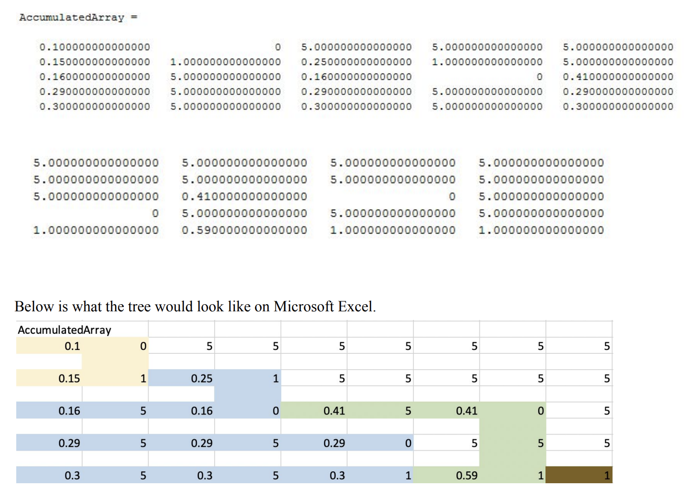
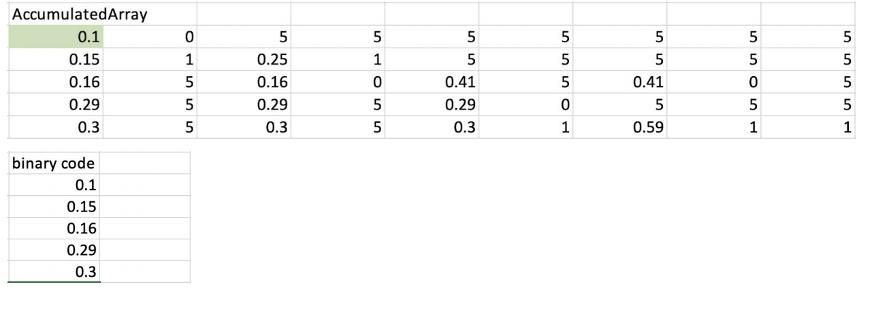
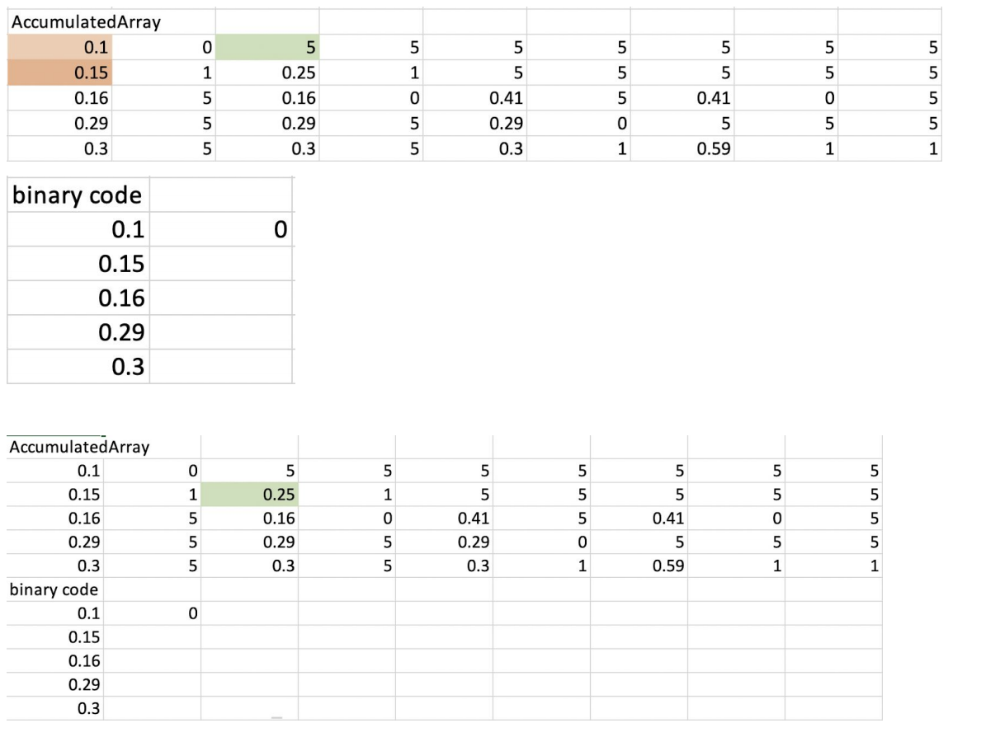
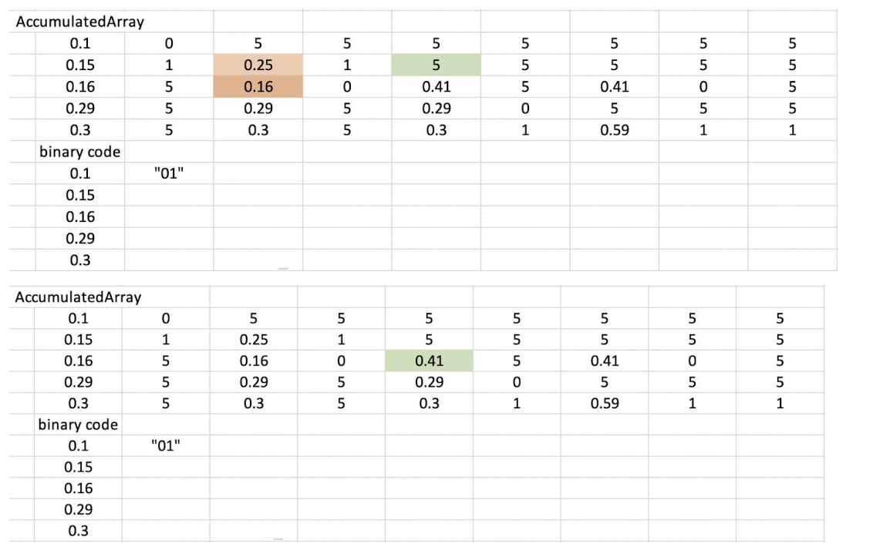
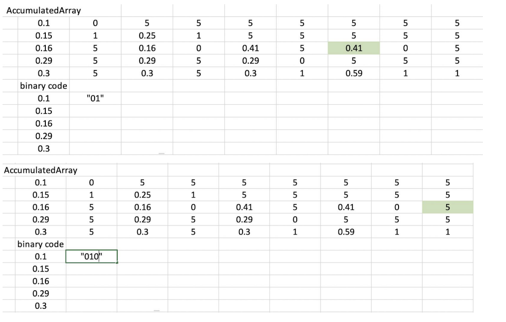
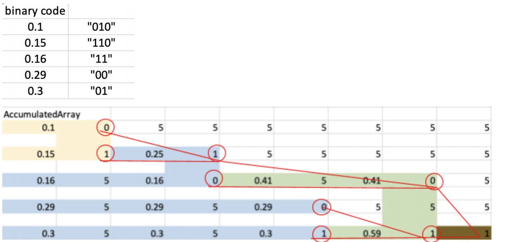
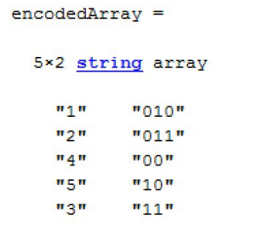

# File-Compressor

The goal of this project is to give us hands-on experience on using statistical and probabilistic
concepts in a real application. We were able to achieve this goal in this project where we
designed and coded a compression algorithm using Huffman coding.

Huffman coding is an algorithm to generate optimal prefix codes for lossless data compression.
It works in a way such that characters with higher frequency are encoded with less bits than
characters that occur less frequently.

Here is an example of how Huffman Coding works in the diagram below.

# Compression

For the first part of the project, we worked on developing a program that takes a .mat file with
samples of a random variable to generate a compressed bin file. It also generates a histogram of
the values in the original file to have a visual representation of the frequencies.

First of all, we created a 2x5 matrix. The first column represents the letters. 1 is A, 2 is B, etc.
The second column is the probability that a letter will occur.

Then, we sorted the matrix in ascending order based on the probability, which gives us the
matrix below.

We created an array called AccumulatedArray. AccumulatedArray contains all the information
needed when constructing the “tree”. Note that all the 5s in AccumulatedArray will be ignored.
The very first column of AccumulatedArray is the sorted probability.

First, we pick the minimum and second minimum probability in the current column and label
them as M1 and M2 respectively. For now, the current column is the first column.We then
created a second column and put 0 to the right of minimum, 1 to the right of second minimum
and 5 to others. Then we added a third column. This column acts as the parents of the leaf
nodes(first column). As can be seen in the diagram below, the first and second element of the
third column are 5 and 0.25, respectively.

Whenever M1 and M2 are added, we will replace the one with lower index in the column with 5
(useless) and the one with higher index with the sum at the current+2 column. That is the first
iteration. We keep doing it until the last column contains only one 1 and the rest are 5s. After
finishing the iteration, the result can be seen in the diagram below.

Then this is the crucial part because we are assigning the binary code. In this part, we use a for
loop and a while loop. The for loop is used to run through each of the rows and the while loop to
run from first column to the last column. We also have a 2x5 matrix to store the binary code

In the first Iteration of for loop, the current location(green) would be 0.1.

While current location is not at the last column, it will iterate two steps to the right. There are 3
scenarios;

(1) if the current location is the same as the previous location
● Do nothing
(2) if the current location is 5
● Concat number in column-1 to binary matrix, identify the higher index between the
minimum and second minimum in column-2 and move current location to that index in
the same column.
(3) if the current location is not the same as the previous location.
● Concat number in column-1 to binary matrix and stay at the same location

But let’s just follow one step at a time for now. From the current location it goes to the next 2
columns in the same row. As can be seen below, now the current location(green) is 5. This is the
scenario (2). Concat the number in column-1 to the binary matrix. Then, look at column-2 and
pick the highest index between minimum and second minimum. Move the current location to
that index in the same column.

Repeat the while loop process and move to column+2. It is a 5, so it is the same process as
before. Concat the number in column-1 to the binary matrix. So, look at column-2 and pick the
highest index between minimum and second minimum. Then, move the current location to that
index in the same column.

Now, we move the current location to column+2. It is 0.41. It is the same number as column-2.
This is scenario (1). So ignore the 5 in column-1 and move to column+2 for the next step.

Now that it reaches the last column, the while loop breaks and the code runs the second iteration
of the for loop. Eventually, we get the result as shown below.

Note that this is not the final result. In regular Huffman code, we read the tree from top to
bottom. In our case, we read it from bottom to top. So, we just need to flip the result and we have
the Huffman code.

After generating this encoding, we then have to read through the original data, match each value
with its corresponding Huffman code, and then write that code into the binary file as a binary
number. We ensure that all the bits are stored in order by specifying a big-endian format in the
fwrite function.
If the original data file is called XXX.mat, then the PMF file is called XXX-PMF.mat, and the
binary file is called XXX.bin. The PMF is stored in an array called originalArray.

