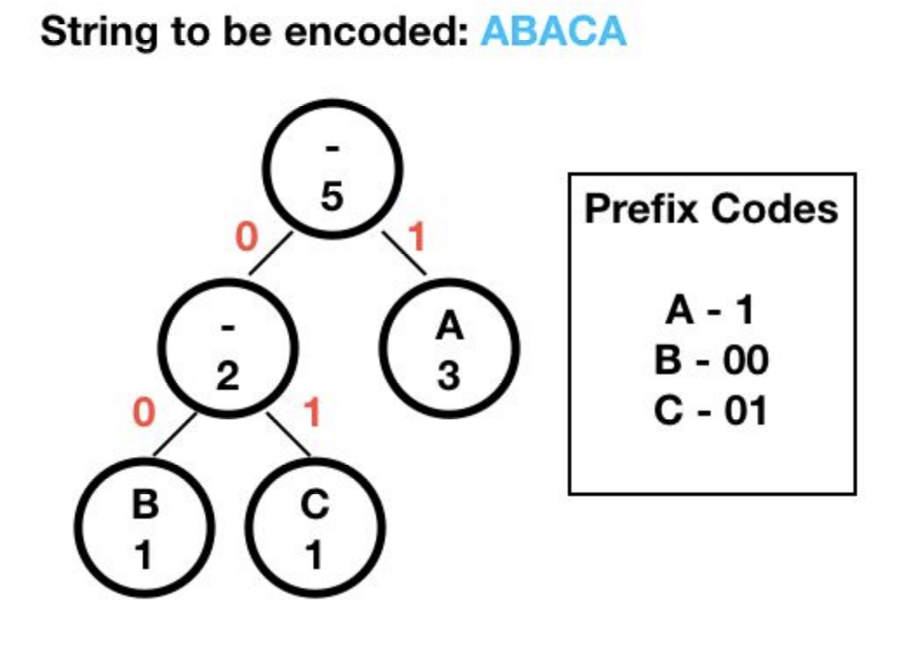
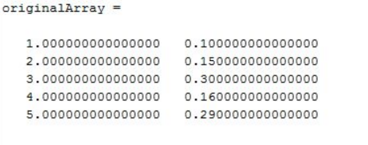
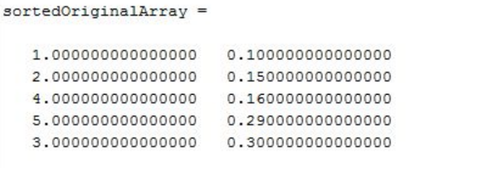
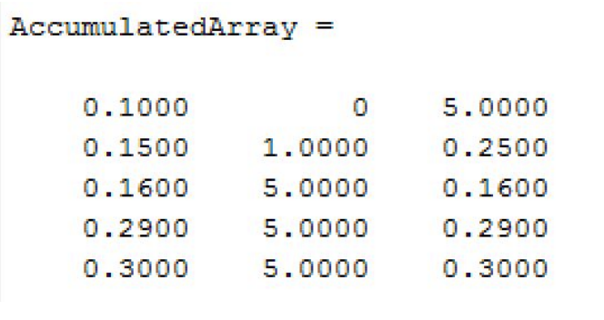

# File-Compressor

The goal of this project is to give us hands-on experience on using statistical and probabilistic
concepts in a real application. We were able to achieve this goal in this project where we
designed and coded a compression algorithm using Huffman coding.

Huffman coding is an algorithm to generate optimal prefix codes for lossless data compression.
It works in a way such that characters with higher frequency are encoded with less bits than
characters that occur less frequently.

Here is an example of how Huffman Coding works in the diagram below.

# Compression

For the first part of the project, we worked on developing a program that takes a .mat file with
samples of a random variable to generate a compressed bin file. It also generates a histogram of
the values in the original file to have a visual representation of the frequencies.

First of all, we created a 2x5 matrix. The first column represents the letters. 1 is A, 2 is B, etc.
The second column is the probability that a letter will occur.

Then, we sorted the matrix in ascending order based on the probability, which gives us the
matrix below.

We created an array called AccumulatedArray. AccumulatedArray contains all the information
needed when constructing the “tree”. Note that all the 5s in AccumulatedArray will be ignored.
The very first column of AccumulatedArray is the sorted probability.

First, we pick the minimum and second minimum probability in the current column and label
them as M1 and M2 respectively. For now, the current column is the first column.We then
created a second column and put 0 to the right of minimum, 1 to the right of second minimum
and 5 to others. Then we added a third column. This column acts as the parents of the leaf
nodes(first column). As can be seen in the diagram below, the first and second element of the
third column are 5 and 0.25, respectively.

Whenever M1 and M2 are added, we will replace the one with lower index in the column with 5
(useless) and the one with higher index with the sum at the current+2 column. That is the first
iteration. We keep doing it until the last column contains only one 1 and the rest are 5s. After
finishing the iteration, the result can be seen in the diagram below.

